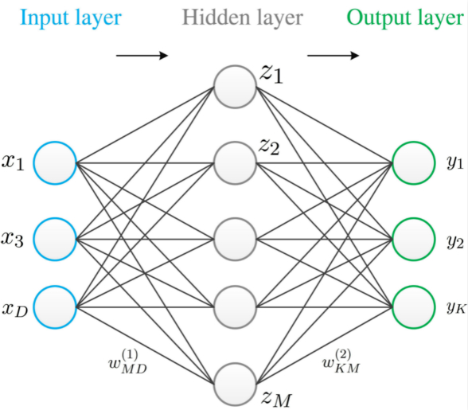
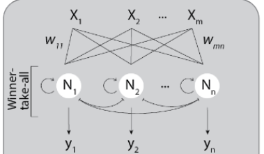
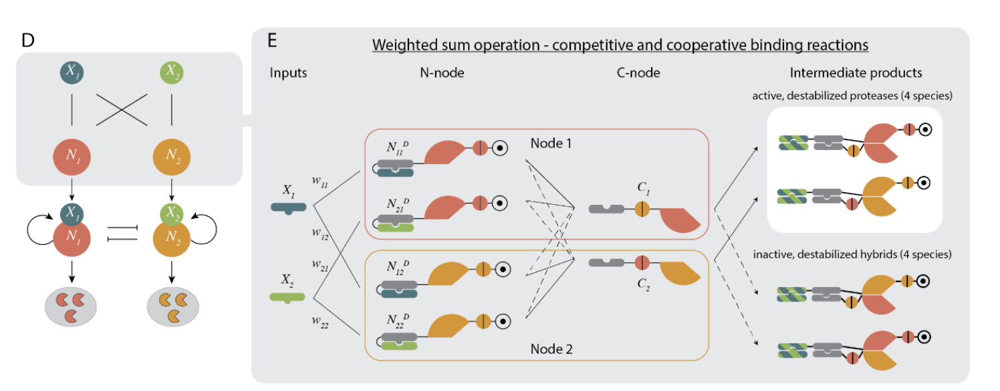

## **Synthetic biological neural networks（SYNBIONN）**

## 前沿论文介绍

<!--
各位上午好，我们组将要介绍的是合成生物神经网络的一篇前沿论文，合成生物神经网络的英文简写如标题所示，注意并不是完全的首字母缩写，后面的 slides 中我们就使用这个简称指代合成生物神经网络。
-->

 
 
 

唐林峥、张语晴、高圣涵

---

# SYNBIONN 是合成生物学的前沿

<!-- 
首先介绍一下这个领域的研究意义。

估计不管是不是信院的同学，大家或多或少都对神经网络有一定的了解。至少应该知道神经网络的目标和成果是在计算机上一定程度地实现人工智能。而对应地，合成生物神经网络的目的，也是为了让生物系统能够具备一定的智能。

按照实现的方式，合成生物神经网络可以分为单细胞神经网络和多细胞神经网络。

对于这两种不同的实现方式，其实对应的应用也有所不同。

单细胞神经网络专注于提高单个细胞的判断和学习能力，因此适合用在需要对单个细胞行为进行精细控制的领域。比如细胞疗法、生物传感器、药物投送、个性化医疗等。

多细胞神经网络则更适合用在需要大规模细胞协同工作的领域：比如低功耗生物人工智能、帮助研究理解神经退行性疾病。

在 Slides 上还列出了一个比较有意思的应用，反哺硅基神经网络的研究。

要知道神经网络是计算机科学家试图模仿生物神经网络的产物，然后生物科学家又试图用合成生物神经网络来模仿计算机神经网络，接着我们不妨想想，极有可能在研究合成生物神经网络的过程中，我们又会发现单纯研究计算机神经网络的设计上的很难发现问题，从而反哺计算机神经网络的研究。这种螺旋上升的潜在结果是非常有趣的。
-->

SYNBIONN 的研究和实现可以为我们带来：

  

    <strong>单细胞神经网络：</strong>
    <ul>
      <li>细胞疗法</li>
      <li>生物传感器</li>
      <li>药物投送</li>
      <li>个性化医疗</li>
    </ul>
  

  

    <strong>多细胞神经网络：</strong>
    <ul>
      <li>低功耗生物人工智能</li>
      <li>帮助研究理解神经退行性疾病</li>
      <li>反哺硅基神经网络的研究</li>
    </ul>
  

---

# 论文：哺乳动物细胞中蛋白质水平的神经网络

<!-- 
接下来我们就要正式引入这次的主角。

这篇论文是由陈子博，陈教授及其团队在 22 年 7 月 11 日发表的。需要提到的一点是 BioRxiv 实际上是一个预印本平台，这意味着这篇论文可能还没有经过同行评审。
 -->

**"A synthetic protein-level neural network in mammalian cells"**

2022 年 7 月 11 日在 BioRxiv 上发表

---

# 主要作者：陈子博
<!-- 
不过呢本文的主要作者陈教授的学术背景还是非常值得我们信赖的。

他在博士时师从华盛顿大学 David Baker教授，博士后工作时又跟随 Caltech 的 Michael Elowitz教授，两位都是合成生物学领域的大牛。

目前他的论文引用次数已经超过了 2000 次，最近在西湖大学组建了自己的实验室，主要研究方向就是研究如何蛋白质设计的技术来实现生物编程。
 -->

  

      <strong>现任西湖大学助理教授</strong>
    <ul>
      <li style="font-size: 30px">领域方向：蛋白质设计、生物编程</li>
      <li style="font-size: 30px">博士学位：生物化学，华盛顿大学</li>
      <ul>
      <li style="font-size: 30px">导师：David Baker</li>
      </ul>
      <li style="font-size: 30px">博士后：合成生物学，加州理工学院</li>
            <ul>
      <li style="font-size: 30px">导师：Michael Elowitz</li>
      </ul>
      <li style="font-size: 30px">引用次数：2,000+（谷歌学术）</li>
    </ul>
  

  

    
  

---

# 相关前期工作

<!-- 
这里我们简单介绍一下本篇论文之前，陈教授团队的相关工作。

在2016 年，陈教授团队实现了一种算法，这种算法能够大大提高蛋白质的设计效率。

接着在 2019 年，借助之前的算法，陈教授团队实现了一种正交异源二聚体蛋白的编程化设计。所谓正交蛋白就是指在细胞内不会相互干扰的蛋白，这对于蛋白质的模块化设计是非常重要的。而文中提出的模块设计范式让设计蛋白时可以像写代码一样，通过调用模块来实现蛋白质的设计。

而蛋白质水平的神经网络便直接依赖于 2019 年的成果。利用快速设计正交蛋白的能力，陈教授团队实现了一种能够在细胞内部运行的神经网络。

接下来我们就来看看最新论文中的神经网络是如何实现的。
 -->

- **2016**：De novo design of protein homo-oligomers with modular hydrogen-bond network-mediated specificity
    > 设计了一种能够按照计算指定蛋白质结构对应的氢键网络结构的算法

- **2019**：Programmable design of orthogonal protein heterodimers
    > 利用前者的结果实现了正交异源二聚体蛋白的编程化设计    

---

# 工作原理概述 [1]：神经网络

<!-- 
首先我们还是需要回顾一下神经网络的相关概念。如图所示，一个基本的神经网络包含三种类型的层：输入层、隐藏层和输出层。输入层接收外部数据，隐藏层处理输入数据（一个或多个隐藏层可以提取输入数据的特征），最后输出层产生最终的结果或预测。

每个神经元与相邻层的其他神经元通过“权重”相连接，这些权重代表了连接的强度。当一个神经元接收到输入（来自原始输入或其他神经元的输出）时，它会根据这些输入和相应的权重计算一个加权和，然后由一个激发函数来决定是否，以及如何激活当前神经元的输出。
-->

神经网络是一种受人脑工作原理启发的计算系统。

---

# 工作原理概述 [2]：WTA 神经网络
<!-- 
在论文中，实现的目标是一种特殊的神经网络，称为 WTA 网络，直译过来叫做赢者通吃。

其实意思就是最后只有一个神经元，也就是所谓的赢者，能够被激活，并输出信号。

而为了实现这个特性，通常引入的机制便是让同一个隐藏层中的神经元们之间可以互相抑制，并且自己能够自我激活来对抗其他神经元的抑制。
-->

- WTA （Winner takes all：赢者通吃）
- 每个神经节点能够自我激活并抑制其他神经节点。
- 最后只有一个神经元（赢者）输出信号

---

# 工作原理概述 [3]：如何表达 WTA 神经网络
<!-- 
那么我们如何在细胞内部实现这样的神经网络呢？

我们要知道，神经网络本质上，其实是一种信息的处理系统。也就是说只要我们能够在一个系统找到信息的载体，再设计他们之间的传递关系，就能够实现一个神经网络。这个系统当然可以是生物系统，甚至可以是一个化学系统。

而在论文中，使用的信息载体就是不同种类的蛋白质，以及蛋白酶的在细胞内的浓度，信息的传递则是通过蛋白质之间的理化反应来实现的。

中间隐藏层的神经元使用的是互相切割的蛋白酶，这样就能够实现神经元之间的相互抑制，而同时在蛋白酶上故意设计了一个容易是蛋白酶失活，但是自己又能切割掉的点位，来实现神经元自我激活。

最后，系统稳定后，浓度最高的那种蛋白酶所代表的信号，就是被输出的信号。
-->

- 信息载体：不同种类蛋白质、蛋白酶的浓度
- 信息传递：蛋白质之间发生理化反应
- 神经元相互抑制：使用互相切割的蛋白酶
- 神经元自我激活：让蛋白酶通过切割自身特定点位提升稳定性
- 输出：系统稳定后浓度最高的那种蛋白酶所代表的信号被输出

---

<!-- 这张论文中出现的图表简洁地说明了其中的生物学原理，不同颜色的分子代表不同种类的蛋白质，各种连接的线条代表不同种类的理化反应，出于时间限制，更加具体的讲解我们将留到下一次正式演讲的时候 -->

---
# 明显的限制

<!-- 
论文中设计了精妙的实验来验证这种神经网络的可行性，因为只是介绍，所以我们就不展开介绍了。

最后陈教授团队也在论文中提到了这种方法的明显限制，主要有两点：

一，实现的神经网络暂时无法在细胞内进行学习。因此常见的做法是提前在计算机进行模拟，相当于“预训练”模型，然后在实际构建中使用这些预训练得到的参数。

二，如果尝试设计大规模的神经网络，比如增加输入输出的数量，或者增加隐藏层的数量，会带来蛋白质设计复杂度的快速上升，虽然已经有一些算法可以帮助设计蛋白质，但是这种复杂度的增加还是会带来很大的挑战。
-->

- 神经网络无法在细胞内部进行学习，隐藏层的权重参数都是人为设计

- 大规模的神经网络（IO规模，网络层数）会带来蛋白质设计复杂度的快速上升

---

# 参考文献

- De novo design of protein homo-oligomers with modular hydrogen-bond network–mediated specificity

- Programmable design of orthogonal protein heterodimers

- A synthetic protein-level neural network in mammalian cells

- Synthetic biological neural networks: From current implementations to future perspectives

---

## **提问环节**

